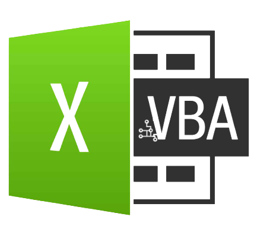
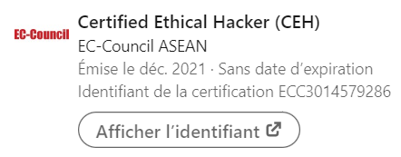

<!--

  

---
-->

---

  

<h2 align="center"></h2>

## Presentation

## **Languages and Tools:**  

> #### IDE
> <code></code>
> <code></code>
> <code></code>

> #### Languages
> - Interpreted
>> <code></code>
>> <code></code>
>> <code></code>
>> <code></code>  
> - Compiled / Assembly
>> <code></code>
>> <code></code>
>> <code></code>
>> <code></code>

> #### Database
> <code></code>
> <code></code>
> <code></code>

> #### Versionning
> <code></code>
> <code></code>
> <code></code>

> #### Virtualisation
><code></code>
<code></code>
<code></code>

> #### Containerization
><code></code>
><code></code>

> #### Orchestrator
><code></code>
><code></code>
><code></code>

> #### Systems
> <code></code>
> <code></code>

> #### Others
> <code></code>
> <code></code>
> <code></code>
> <code></code>
>
---

## Medium Articles
Lorem ipsum

## Projects
Lorem ipsum

## Repos

## Certifications
<!--
Regrouper entre 
- certifications fonctionnelles (ISO 27001 Lead Auditor/Implementor, CISSP)
----
- certifications techniques (CEH/OSCP)
----
- certifications admin (LPIC 100-500, CKA, etc)
-->
><code></code>

---
<h3>🏆 Github Profile Trophy</h2>

---

<!--
 <a target="_blank" href="https://github-readme-medium-recent-article.vercel.app/medium/@shinichiokada/0">

<a target="_blank" href="https://github-readme-medium-recent-article.vercel.app/medium/@shinichiokada/2">
-->

 
<table border=1>
<tr>
Interpreted
</tr>
<tr>
<td></td>
<td> [2019] Soccer Simulator</td>
<td> [2020] Rogue AP - Evil Twin</td>
<td> [2020] Chiffrement par bloc</td>
<td> [2020] Web Scrapping</td>
<td> [2022] CryptoLocker</td>
</tr>
<tr>
<td></td>
<td> [2019-2022] Debian's Scripts</td>
<td> [2020] Hardening Debian</td>
</tr>
<tr>
<td></td>
<td> [2021] Discord Bot</td>
<td> [2021] Web Application - PDF Extraction</td>
</tr>
<tr>
<td></td>
<td> [2021] Data restructuring</td>
<td> [2022] Malicious Excel</td>
</tr>
<tr>
<td></td>
<td> [2022] AD Script</td>
<td> [2022] Hardening Windows 11</td>
</tr>
</table>

<table border=1>
<tr>
Compiled / Assembly
</tr>
<tr>
<td></td>
<td></td>
</tr>
<tr>
<td></td>
<td>  test</td>
<td></td>
</tr>
<tr>
<td></td>
<td></td>
<td></td>
</tr>
<tr>
<td></td>
<td></td>
<td></td>
</tr>
</table>